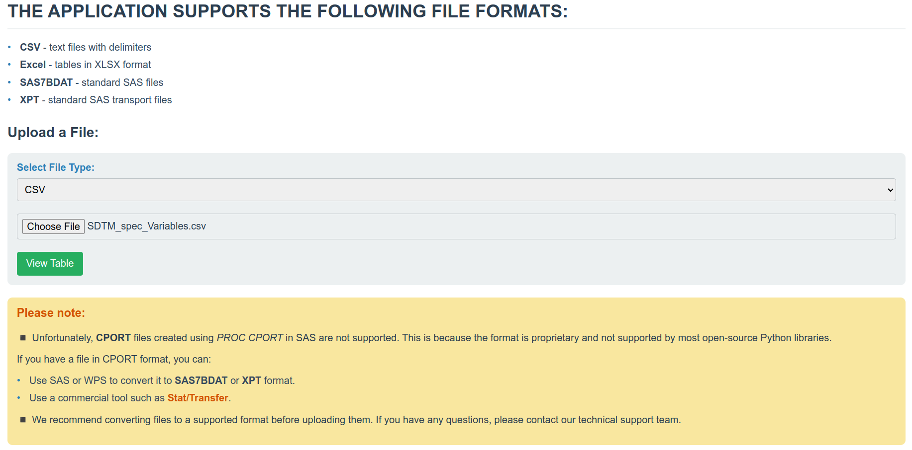
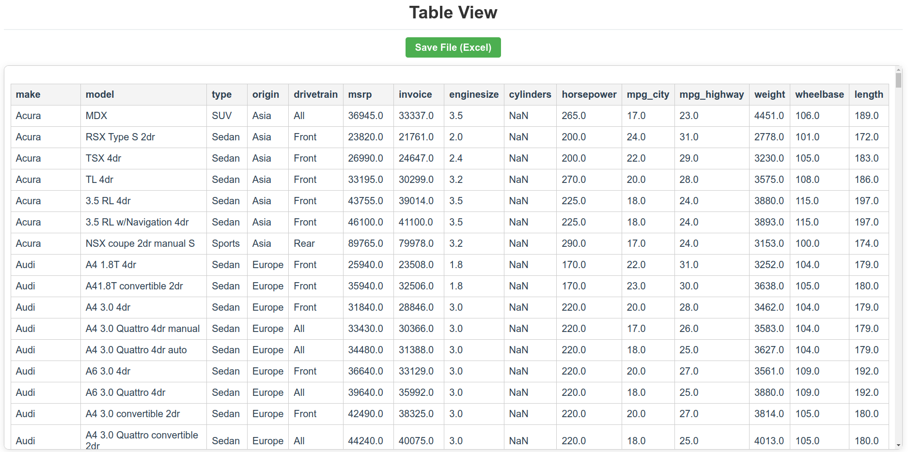

# Tabular Viewer: A Flask Application for Viewing Tabular Data



## Overview:
This project is a Flask-based web application designed to view tabular data in various formats. The application supports file uploads and renders tabular data in an HTML table format for easy visualization. Additionally, it provides an option to download the data as an Excel file.

## Supported File Formats:
The application supports the following file formats:

1. **CSV**: Text files with delimiters such as commas or other characters.
2. **Excel**: `.xlsx` files created in Microsoft Excel.
3. **SAS7BDAT**: Standard SAS data files.
4. **XPT**: Standard transport files used in SAS.

### Limitations
- **CPORT Files**: SAS CPORT files are not directly supported due to their proprietary nature. If a CPORT file is uploaded, users are informed that the format is unsupported and provided with guidance on converting it to a supported format.

## Project Structure:
```
TabularViewer/
├── app.py             # Main Flask application
├── templates/         # HTML templates for the web interface
│   ├── base.html      # Base template for consistent layout
│   ├── index.html     # Upload interface
│   ├── table.html     # Table display interface
├── static/            # Static files (CSS, JavaScript)
│   ├── styles.css     # Custom styles
├── converted_files/   # Folder for saving uploaded files
├── README.md          # Project documentation
├── requirements.txt   # Python dependencies
```

## Installation:
1. Clone the repository:
   ```bash
   git clone <repository-url>
   cd atorus_test_task
   ```

2. Create a virtual environment and activate it:
   ```bash
   python3 -m venv venv
   source venv/bin/activate   # On Windows: venv\Scripts\activate
   ```

3. Install dependencies:
   ```bash
   pip install -r requirements.txt
   ```

4. Run the application:
   ```bash
   python app.py
   ```

5. Open the application in your browser:
   ```
   http://127.0.0.1:5000
   ```
   


## Features:
### 1. File Upload Interface
Users can upload files through the `/` endpoint. The interface allows selecting a file type and uploading a file for processing.

### 2. Table Rendering
Uploaded files are processed and displayed as an HTML table at the `/view` endpoint. The table is:
- Cleaned of unnecessary characters and whitespace.
- Displayed with a responsive layout.

### 3. File Download
Processed data can be downloaded as an Excel file via the `/save` endpoint.

### 4. Error Handling
The application provides meaningful error messages for unsupported formats or invalid file structures.


## Libraries Used:
1. **Flask**: Web framework for Python.
2. **Pandas**: Data manipulation and analysis.
3. **Pyreadstat**: Reading SAS and SPSS files.
4. **Chardet**: Detecting file encodings.
5. **Openpyxl**: Writing Excel files.

## Conclusion:
This project demonstrates how to build a file processing web application using Flask. The system processes various tabular formats, cleans data, and presents it in an accessible HTML table. Unsupported formats like CPORT are handled gracefully with user-friendly error messages and guidance on conversion.

